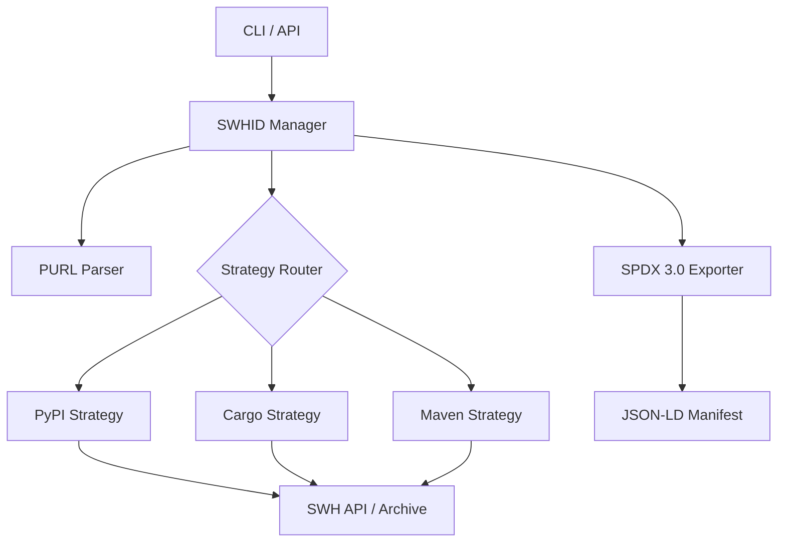

# SWHID Verification Tool

[](https://opensource.org/licenses/MIT)
[](https://www.python.org/downloads/)
[](https://www.softwareheritage.org/)

A verification framework designed to map Package URLs (PURLs) to verified Software Heritage Identifiers (SWHIDs). This tool ensures cryptographic and structural provenance by establishing a verifiable link between software distributions and their canonical source code archived in the Software Heritage (SWH) ecosystem.

## The Semantic Gap

In modern software development, we interact with dependencies using package-level identifiers (e.g., `lodash@4.17.21` or `requests@2.31.0`). However, these packages are mutable and vulnerable to supply chain tampering. 

To guarantee reproducibility and security, we need **cryptographic, content-addressed identifiers** like Software Heritage Identifiers (SWHIDs). Currently, there is a **semantic gap** between the package managers and the archive. This tool bridges that gap by automatically resolving package releases to verified SWHIDs across 6 major registries: **PyPI**, **npm**, **Cargo**, **Go Modules**, **Maven Central**, and **NuGet**.

## Dataset

Two datasets are published, at different scales, and they should be read together rather than in isolation.

The original showcase — 25 packages across all 6 ecosystems, [`dataset/showcase_manifest.jsonld`](dataset/showcase_manifest.jsonld) — is 4% Verified, 72% Inferred, 4% Partial, 20% Failed. On its own that number looks bad. It is left in the repository unchanged because it is an honest record of how ambiguous PURL→SWHID mapping is before any ecosystem-specific normalization exists, not a result to be smoothed over.

The full dataset — 300 packages, 50 per ecosystem, in [`dataset/`](dataset/) as CSV, SPDX 3.0 JSON-LD, and a [findings report](dataset/findings_report.md) — is 63.7% Verified overall. That aggregate is not the point; the per-ecosystem breakdown is:

| Ecosystem | Verification Rate |
| :--- | ---: |
| PyPI / npm / NuGet | 100% |
| Go Modules | 74% |
| Maven Central | 8% |
| Crates.io | 0% |

The three ecosystems at 100% are the ones where the registry itself publishes a checkable link to a source commit — a Sigstore attestation, or a Git tag that matches a SWH snapshot branch. Crates.io does this too: every crate's `.cargo_vcs_info.json` records the exact commit SHA it was built from, and the tool extracts and normalizes it correctly. The 0% is not a normalization failure — it is a direct measurement of how many of the top 50 crates by downloads have that recorded commit already present in the Software Heritage archive: none of them, at time of writing. Maven's 8% is a related but different problem: Central serves compiled JARs, and only a minority of artifacts publish a `sources.jar` to resolve against at all.

So the dataset is not only a report on the tool. It is a measurement of the gap between "the registry claims a source commit" and "the archive already has it" — per ecosystem, which is a more specific question than a single verification percentage can answer.

## Key Features

*   **Multi-Ecosystem Support**: Specialized verification strategies for **PyPI**, **npm**, **Cargo**, **Go Modules**, **Maven Central**, and **NuGet**.
*   **High-Confidence Provenance**:
    *   **PyPI**: Extraction of commit SHAs from Sigstore/PEP 740 attestations via Fulcio certificates.
    *   **Cargo**: Deterministic normalization and restoration of original project state for byte-for-byte matching.
    *   **Maven**: SCM metadata resolution and verification of cleaned source artifacts.
*   **OSV.dev Vulnerability Mapping**: Content-based vulnerability scanning. Maps resolved cryptographic commit SHAs (`swh:1:rev:...`) to known vulnerabilities in the OSV.dev database, eliminating false-negatives from package renaming/forks.
*   **CI/CD Gatekeeping Policy Engine**: Define compliance rules in `swhid-policy.toml` (e.g. minimum confidence levels, fail-on-vulnerabilities, fail-on-mismatch, allowlists) to automatically break builds in CI/CD pipelines.
*   **SPDX 3.0 Compliance**: Generation of RDF-compatible JSON-LD manifests using official SPDX models.
*   **Automated Archival Integration**: Proactive use of the Software Heritage "Save Code Now" API.
*   **Installation Verification**: Local filesystem scanner to audit installed package directories and files recursively against verified SWHID ground truth.

## Installation

### Prerequisites
- Python 3.9+
- [Optional] A Software Heritage API Token for higher rate limits.

### Setup
```bash
git clone https://github.com/OdysseasKalaitsidis/SWHID_POC
cd SWHID_POC
python -m venv venv
source venv/bin/activate  # Use .\venv\Scripts\activate on Windows
pip install -r requirements.txt
```

## Configuration

The tool can be configured via environment variables or a `.env` file:

| Variable | Description | Default |
| :--- | :--- | :--- |
| `SWH_TOKEN` | Software Heritage API Authentication Token | None |
| `CACHE_DIR` | Directory for caching resolution results | `./cache` |
| `LOG_LEVEL` | Logging verbosity (DEBUG, INFO, ERROR) | `INFO` |

## Usage

### Quick Start
Map a single PURL to a verified SWHID immediately:
```bash
python -m swhid_tool.cli swhid-map pkg:pypi/six@1.17.0
```

### Batch Processing
Generate an SPDX 3.0 dataset for multiple PURLs:
```bash
python -m swhid_tool.cli batch-process input_purls.txt output_report.jsonld
```

### Integrity Auditing
Verify a local directory against a verified manifest:
```bash
python -m swhid_tool.cli verify-path /path/to/installed/library manifest.jsonld
```

### REST API (Experimental)
Deploy as a service using FastAPI:
```bash
python -m uvicorn swhid_tool.api:app --host 0.0.0.0 --port 8000
```

## Architecture

The system utilizes a strategy-based pattern to decouple ecosystem-specific logic from the core resolution engine.



## What This Tool Verifies (and What It Doesn't)

A SWHID is a content-addressed hash: it identifies an exact set of bytes, nothing more. The hard part of this project is not computing that hash, it's being precise about *what bytes it was computed from* — a package release, its source tree, and the artifact that eventually lands in a `site-packages` or `node_modules` directory are three different things, and conflating them produces a false sense of provenance.

**What a `Verified` result means:** the SWHID was independently recomputed — either from the commit referenced by a signed attestation (PyPI Sigstore/PEP 740), from a matched Git tag, or from a normalized source distribution — and matches an object already present in the Software Heritage archive. This is a claim about **source provenance**: *this release corresponds to this exact, archived source tree.*

**What it does not claim:** that the compiled, platform-specific artifact installed on any given machine is byte-identical to that source tree. A single `pip install X` can produce different files depending on OS, architecture, and Python version — compiled extensions, generated bindings, and build-time metadata have no upstream Git equivalent to hash against. Collapsing "verified source" and "verified installed binary" into one SWHID would overstate what the archive can actually prove, which is why:

- Confidence is reported on a four-level scale (`Verified` / `Inferred` / `Partial` / `Failed`), not as a boolean, and every PyPI result carries the chain of strategies attempted (attestation → metadata/tag matching → normalized file-level hashing) so the basis for the claim is inspectable, not asserted.
- Source verification and installed-artifact verification are two separate operations: `swhid-map`/`audit` verify the **release's source**; `verify-path` (and `audit`'s local-installation scan) separately hashes what's **actually on disk** in a given environment and diffs it against the verified source SWHID. A mismatch there is not a bug in the tool — it's the environment-dependence problem made visible instead of hidden.

## Validation and Standards

Verification findings are exported as SPDX 3.0 documents. Compliance with RDF standards is ensured through SHACL shape validation using the integrated `test_validation.py` suite.

## Documentation

Detailed guides for different stakeholders:
- [**User Guide**](user_guide.md): CLI reference, API specifications, and troubleshooting.
- [**Developer Guide**](developer_guide.md): Extending the tool to new ecosystems and core internals.
- [**Maintainer Guide**](maintainer_guide.md): Best practices for enabling high-confidence verifiability.

## Contributing

Contributions are welcome! Please see the [Developer Guide](developer_guide.md) for setup instructions and coding standards.

## License

This project is licensed under the MIT License - see the [LICENSE](LICENSE) file for details.

## Acknowledgments

This project was independently developed, inspired by a GSoC proposal for [Software Heritage](https://www.softwareheritage.org/). The [SWHID standard (ISO/IEC 18670:2025)](https://swhid.org) and the Software Heritage archive are projects of [Inria](https://www.inria.fr/).
